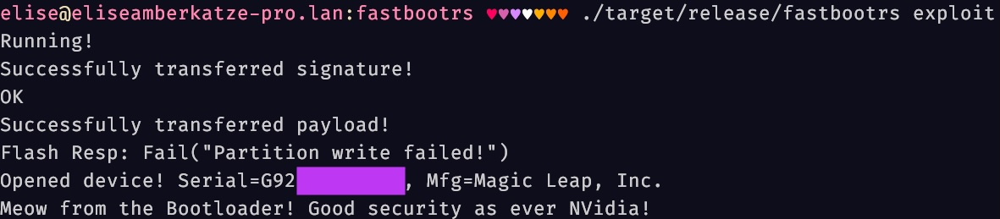

# Magic Leap One Exploitation

## Overview

This repository contains a (messy) implementation of my research of exploiting the Magic Leap One.

I will add writeups eventually, but for now, I just wanted to publish my code and give a simple explanation.

The `fastbooted` folder contains the code that runs on the Magic Leap console.

The `fastbootrs` folder contains a Rust implementation of a Fastboot client, and is the code that runs on the host.

`SHA256(ML1 SBK)=25861920c4b750caaa851de7f92edbcf5fa3dfc396c54a871edff250ada8aa97`

## Vulns

This repository contains implementations of two vulns:

1. Code Execution in CBoot over Fastboot USB by smashing the stack in NVidia's SparseFS parser (`sparsehax`)
2. Overwriting CBoot in memory using an oversized `kernel-dtb` implementation on the storage to gain persistant code execution (`dtbhax`)

Both of these may effect more than just the ML1. I've not researched it much but there's a decent chance the `kernel-dtb` vuln can be used for persistence on the Autopilot units of certain cars using the TX2.

## Usage

Warning: It's your responsibility if you brick your console.

You need a signed signature context (list of hashes with a small header and a signature) from a firmware update for your device (this is device unique), any partition works as long as it's for your device, I've been using the one from the system image. Place it in `fastbootrs/system-sparse-sig.bin`.

Inside the `fastbooted/payload` directory:

1. Copy `sparsehax.ld` to `ccplex.ld`
2. Run `cargo build-usb-bin`
3. Copy the generated `payload.bin` file to `fastbootrs/src/payload.bin`

Put your ML1 console into Fastboot by powering it off, and holding the Vol-Down button whilst powering the console on.

Inside the `fastbootrs` directory:

1. Run `cargo run --release -- exploit`
2. Success?

If these instructions aren't clear enough, this probably is not ready for you currently.

## Writeup

Coming soon
